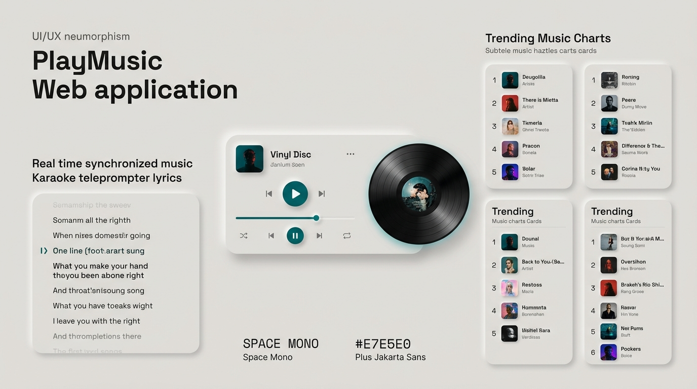

# PlayMusic — Tactile Neumorphism Music Player & Global Chart Radar

<p align="center">
  
</p>

<p align="center">
  <a href="https://playmusic.kheireditz.my.id"></a>
  <a href="https://github.com/kheireditzz/playsound-web"></a>
  
  
  
</p>

---

## 📌 Ringkasan

**PlayMusic** adalah aplikasi web pemutar musik streaming modern dan radar tren lagu viral global yang dibangun dengan pendekatan desain **Tactile Neumorphism** murni. Menghadirkan antarmuka fisik yang intuitif, sinkronisasi lirik karaoke real-time berbasis teleprompter 60FPS, pemutar video resmi YouTube melayang (*floating picture-in-picture*), serta integrasi audio studio berkualitas tinggi tanpa iklan dan tanpa gangguan *playback glitch*.

- **Domain Utama Live**: [https://playmusic.kheireditz.my.id](https://playmusic.kheireditz.my.id)
- **Vercel Mirror**: [https://viral-music-qpeo2pngf-kheireditz.vercel.app](https://viral-music-qpeo2pngf-kheireditz.vercel.app)
- **Repositori Resmi**: [https://github.com/kheireditzz/playsound-web](https://github.com/kheireditzz/playsound-web)

---

## ✨ Fitur-Fitur Unggulan

### 1. 🎤 Lirik Karaoke Real-Time (Synced Teleprompter)
- **Sinkronisasi Halus 60FPS**: Menggunakan loop `requestAnimationFrame` untuk penandaan baris aktif secara instan tanpa jeda pembacaan waktu.
- **Scroll Otomatis Presisi**: Lirik otomatis bergulir ke tengah layar (*center aligned auto-scroll*) mengikuti alur vokal lagu.
- **Kalibrasi Offset Waktu Manual**: Tersedia kontrol kalibrasi halus (`-0.15s` dan `+0.15s`) serta tombol reset otomatis yang tersimpan permanen per sesi pemutaran.
- **Multi-Source Fetcher**: Mengambil lirik sinkron (.LRC) secara berjenjang dari penyedia global seperti LRCLIB, JioSaavn LRC Engine, dan katalog streaming resmi.

### 2. 🎧 Dual-Engine Audio & Verifikasi Rekaman Asli
- **Anti-Karaoke & Anti-Cover Filter**: Sistem otomatis memfilter dan menolak hasil pencarian palsu seperti *Piano Version*, *Karaoke Backing Track*, atau lagu cover tidak resmi.
- **Hierarki Resolusi Audio**:
  1. *JioSaavn Decrypted Audio*: Kualitas 320kbps HD dengan verifikasi kecocokan artis asli.
  2. *Apple Music / iTunes CDN*: Master studio rekaman resmi berformat AAC jernih.
  3. *Deezer CDN*: Audio preview studio resmi bitrate tinggi langsung dari server resmi.
- **Playback Token Guard & Zero Race Condition**: Penggantian lagu dilengkapi `currentPlaybackToken` dan `AbortController`. Tidak ada lagi delay, hening berkepanjangan, atau tabrakan audio dari lagu sebelumnya saat beralih trek dengan cepat.

### 3. 📺 Floating YouTube Video Modal (Picture-in-Picture)
- **Tonton Video Klip Resmi**: Akses video musik YouTube beresolusi tinggi langsung dari pemutar utama hanya dengan satu ketukan ikon YouTube.
- **Backdrop Protection**: Modal mengambang terlindungi dari penutupan tidak sengaja saat menyentuh layar luar. Modal hanya tertutup melalui tombol `X` atau tombol keluar eksplisit.
- **Direct YouTube Fallback**: Tombol tautan langsung ke aplikasi YouTube resmi jika pengguna ingin membuka di aplikasi bawaan perangkat.

### 4. 💽 Fullscreen Player ala Vinyl Turn-Table
- **Visual Piringan Hitam Dinamis**: Animasi piringan vinyl (*vinyl disc turntable*) yang berputar halus saat musik berjalan dan berhenti lembut saat dijeda.
- **Artwork Backdrop Ambient Blur**: Latar belakang blur adaptif yang mengambil warna dominan dari sampul album lagu yang sedang diputar.
- **Tab Switcher Taktil**: Berpindah mulus antara tampilan cover vinyl dan teleprompter lirik karaoke tanpa menghentikan pemutaran audio.

### 5. 🌍 Radar Chart Musik Viral Global & Lokal
- Menampilkan tangga lagu terpopuler yang diperbarui secara berkala:
  - **Spotify Global Top 50** & **Spotify Viral Hits**
  - **TikTok Viral FYP** & **Trending Sounds**
  - **Billboard Hot 100** & **Billboard Global**
  - **Indonesia Viral Hits** (Tangga lagu artis lokal hits)
  - **UK Official Chart**, **K-Pop Radar**, dan **J-Pop Oricon Hits**
- **Album Detail Explorer**: Jelajahi seluruh daftar lagu dalam satu album lengkap beserta durasi dan nomor trek.

### 6. 📱 Integrasi MediaSession OS Penuh
- Menampilkan judul lagu, artis, nama album, dan artwork sampul resolusi tinggi di:
  - Layar kunci (*Lockscreen*) Android, iOS, Windows, macOS, dan Linux.
  - Pusat notifikasi sistem.
  - Headset Bluetooth & panel navigasi mobil (*Android Auto / Apple CarPlay*).
  - Kontrol fungsional penuh untuk Play, Pause, Next Track, Previous Track, dan Seek Scrubber.

### 7. ⚡ Pengunduh Audio MP3 Satu Klik
- Tombol unduh langsung untuk menyimpan lagu secara lokal.
- Format penamaan file terstruktur otomatis: `[Artis] - [Judul Lagu].mp3`.

---

## 🎨 Filosofi Desain: Tactile Neumorphism

PlayMusic menolak estetika *AI-slop* yang hampa, gradien murah, dan elemen antarmuka datar tanpa bobot. Antarmuka PlayMusic mengadopsi prinsip fisik **Tactile Neumorphism**:

| Komponen | Spesifikasi / Nilai Visual | Fungsi |
|---|---|---|
| **Warna Latar (Surface)** | `#E7E5E4` (Warm Light Gray / Stone) | Permukaan taktil lembut yang ramah di mata |
| **Shadow Timbul (`neu-extruded`)** | `-6px -6px 12px #FFFFFF`, `6px 6px 14px #C7C4C0` | Memberikan kedalaman realistis pada tombol dan kartu |
| **Shadow Cekung (`neu-inset`)** | `inset 4px 4px 8px #D1CEC9`, `inset -4px -4px 8px #FFFFFF` | Menandakan elemen input, bar scrubber, dan item aktif |
| **Warna Aksen Utama** | `#006666` (Deep Teal) | Memberi kontras tajam, elegan, dan profesional |
| **Aksen Notifikasi** | `#00A63D` (Success), `#FE9900` (Warning), `#FF2157` (Danger) | Status audio, bitrate badge, dan indikator koneksi |
| **Tipografi** | *Space Mono* & *JetBrains Mono* (Data/Display) + *Plus Jakarta Sans* (Body) | Keterbacaan teks tajam dan modern |

---

## 🏗️ Arsitektur Sistem

```
┌────────────────────────────────────────────────────────┐
│                   PlayMusic Web App                    │
│             (Tactile Neumorphic Frontend)              │
│       Vanilla JS ES6+ | Web Audio API | MediaSession   │
└───────────────────────────┬────────────────────────────┘
                            │ HTTP / JSON API
                            ▼
┌────────────────────────────────────────────────────────┐
│                 Node.js Native Server                  │
│                (server.js / Express-Free)              │
├───────────────────────────┬────────────────────────────┤
│  Routing & Data Cache     │  CryptoJS Media Decryptor  │
│  In-Memory TTL Map        │  DES-ECB / PKCS7 Algorithm │
└─────────────┬─────────────┴─────────────┬──────────────┘
              │                           │
    ┌─────────┴─────────┐       ┌─────────┴─────────┐
    │   Charts & Feeds  │       │   Audio Resolvers │
    ├───────────────────┤       ├───────────────────┤
    │ Deezer Global API │       │ JioSaavn 320kbps  │
    │ Apple Music RSS   │       │ iTunes Studio CDN │
    │ Spotify Pathfinder│       │ Deezer Audio CDN  │
    │ TikTok Trends     │       │ LRCLIB Lirik Sync │
    └───────────────────┘       └───────────────────┘
```

---

## 🚀 Panduan Instalasi & Menjalankan Lokal

### Prasyarat
- **Node.js** versi 18.0.0 atau lebih baru
- **NPM** atau manajer paket yang kompatibel

### 1. Kloning Repositori
```bash
git clone https://github.com/kheireditzz/playsound-web.git
cd playsound-web
```

### 2. Pasang Dependensi
```bash
npm install
```

### 3. Jalankan Server Pengembangan
```bash
npm start
```
Akses pemutar melalui browser favorit Anda di:
```
http://localhost:3000
```

### 4. Manajemen Proses Produksi dengan PM2 (Opsional)
```bash
# Menjalankan daemon di latar belakang
pm2 start server.js --name "playmusic"

# Memantau aktivitas server
pm2 logs playmusic

# Melakukan restart layanan
pm2 restart playmusic
```

---

## 📡 Dokumentasi Endpoint API

| Metode | Endpoint | Deskripsi |
|---|---|---|
| `GET` | `/api/trends?country=[id\|us\|global]` | Mengambil daftar lagu viral berdasarkan kategori wilayah |
| `GET` | `/api/search?q=[query]` | Melakukan pencarian global lagu, artis, atau album |
| `GET` | `/api/stream?artist=[artis]&title=[judul]` | Mengambil URL audio asli terverifikasi (JioSaavn/iTunes/Deezer) |
| `GET` | `/api/lyrics?artist=[artis]&title=[judul]` | Mengambil teks lirik bersinkronisasi waktu (.LRC) |
| `GET` | `/api/youtube-id?q=[query]` | Mencari ID video resmi YouTube untuk pemutar mengambang |
| `GET` | `/api/album-detail?id=[albumId]` | Mengambil daftar lengkap seluruh trek dalam album |
| `GET` | `/api/download?url=[url]&name=[name]` | Mengunduh file audio MP3 secara langsung |

---

## 👨‍💻 Kontributor & Lisensi

- **Pengembang & Arsitek**: **kheireditz** ([@kheireditzz](https://github.com/kheireditzz))
- **Lisensi**: Proyek ini dirilis di bawah lisensi [MIT License](LICENSE).
- **Situs Resmi**: [https://playmusic.kheireditz.my.id](https://playmusic.kheireditz.my.id)

---
<p align="center">
  Didesain dan dibangun dengan standar presisi tinggi, tactile neumorphism, dan komitmen anti-AI-slop.
</p>
